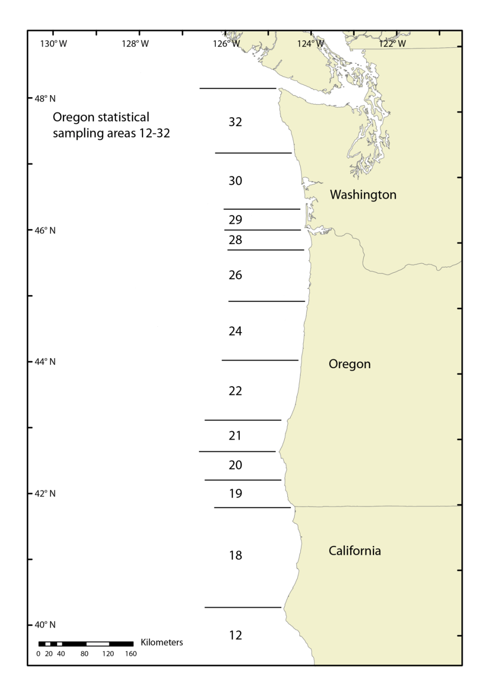

```{r, include = FALSE}
# library(rstan)
# library(tidyverse)
# load('../Code/model_output.Rdata')
```

## Data:
Data we have at month-year-fishing area resolution:

* Average length and sample size for each age class (1-3) from April to October, i.e., up to 21 observations of each year class in a given area, but some combinations are missing. This is from sampling the catch.
* SD for each age class from 2014-2018 (actually have individual data for each shrimp measured in these years)
* Total catch in lbs
* Count per pound
* Percent age composition of the catch by number
* All of this for 1989-2018, though a lot of pubs seems to have 1980-present

Here is a (different) plot of the mean lengths at age by area and year class.

```{r, echo = FALSE, fig.height = 6, fig.width = 6}
ggplot(length.fits, aes(x = Age_Month, y = Avg_Len, group = paste(Year_Class, Area), col = Year_Class)) +
  geom_path(lwd = .25, alpha = 0.5) +
  geom_point(cex=.5, alpha = 0.5) +
  facet_wrap(~Area) +
  labs(x = 'Age (years)', y = 'Mean Length (mm)', color = 'Cohort') +
  NULL
```
Here is a map of the state areas:



## Length model:
$L_{a,y,m}$ is length of age $a$ shrimp in month $m$ of year $y$. Then

$$\begin{aligned}
L_{1,y,1} &= \alpha_0 + \epsilon_{1,y,1} \\
L_{a,y,m} &= \alpha_1 + \beta_1 L_{a,y,m-1} + \epsilon_{a,y,m} \\
L_{a,y,1} &= \alpha_2 + \beta_2 L_{a-1, y-1, m_{\max}} + \epsilon_{a,y,1}
\end{aligned}$$

$\alpha_0$ is average size of age 1 shrimp in April, $\alpha_1$ is the within fishing season monthly growth increment, $\alpha_2$ is the across fishing season growth increment, and $\beta_1$ and $\beta_2$ are the density-dependent terms within and across fishing seasons, respectively. Right now I assume $\alpha_1 = \alpha_2$ and $\beta_1 = \beta_2$ though I don't think that is correct as there is not much wintertime growth. All of these can be functions of environmental variables. There is also an existing theory that growth is density-dependent, so they grow less when there are more shrimp around. The process variability $\epsilon$ follows a normal distribution, and I estimate a separate $\sigma_\text{init size}$ and $\sigma_\text{growth}$.

## Observation model:

$$\bar{L}_{a,y,m,area} \sim N\left(L_{a,y,m} + \gamma_{area}, \frac{\sigma_\text{obs}}{\sqrt{n_{a,y,m,area}}} \right) $$

where $\bar{L}_{a,y,m,area}$ is the empirical mean length for age $a$ in month $m$ of year $y$ sampled in area $area$, $\sigma_\text{obs}$ is the observation standard deviation, $n_{a,y,m,area}$ is the number of age $a$ shrimp that were sampled from the catch in month $m$ of year $y$ in area $area$, and $\gamma_{area} \sim N(0, \sigma_\text{area})$. The $\gamma$ offset allows different areas to have consistently smaller or larger shrimp.

## Fitting:

The model is fit in stan as a multivariate autoregressive state-space model. Each year class is a different "state," but the underlying parameters for each state are the same (for now). Each area represents a different observation process of the same state. 

#Results:

First, here is a table of the estimated parameters. Some of the effective sample sizes are kind of low and I should probaby run this longer.
```{r, echo = FALSE}
mod.summary <- summary(mod, pars = c('x0_mean', 'sigma_x0', 'sigma_area', 'U', 'B', 'sigma_process', 'sigma_obs'))$summary
row.names(mod.summary) <- c('$\\alpha_0$', '$\\sigma_\\text{init size}$', '$\\sigma_\\text{area}$', '$\\alpha_1$', '$\\beta_1$', '$\\sigma_\\text{growth}$', '$\\sigma_\\text{obs}$')
knitr::kable(mod.summary)
```

Second, here is a plot of residuals versus fitted values (using the median from the posterior as the fitted value) with a smoother. We see that the residuals look alright. 
```{r, echo = FALSE}
qplot(MedPredLength, Avg_Len - mean(Avg_Len) - MedPredLength, data = length.fits, alpha = .5) + 
  stat_smooth() +
  geom_hline(yintercept = 0, col = 'red') +
  theme(legend.position = 'none') +
  labs(x = 'Median fitted value', y = 'Median residual') +
  NULL  
```


Here is a plot of residuals split up by area. I fixed the problem!

```{r, echo = FALSE}
ggplot(length.fits) +
  geom_boxplot(aes(x = Area, y = Avg_Len - mean(Avg_Len) - MedPredLength)) +
  geom_hline(yintercept = 0, col = 'red') +
  labs(y = 'Median residual')
```
```{r, echo = FALSE}
ggplot(length.fits) +
  geom_boxplot(aes(x = factor(Year), y = Avg_Len - mean(Avg_Len) - MedPredLength)) +
  geom_hline(yintercept = 0, col = 'red') +
  labs(y = 'Median residual', title = 'Residuals versus year', x = 'Year') +
  scale_x_discrete(labels = c('', 1990, rep('', 9), 2000, rep('', 9), 2010, rep('', 8)))

ggplot(length.fits) +
  geom_boxplot(aes(x = factor(Month_Num), y = Avg_Len - mean(Avg_Len) - MedPredLength)) +
  geom_hline(yintercept = 0, col = 'red') +
  labs(x = 'Month', y = 'Median residual', title = 'Residuals versus Month')
```

I also thought it would be useful to look at the process errors. We can see that the process model is not working great, especially for the first over-winter growth increment.
```{r, echo = FALSE}
ggplot(pro.dev) + 
  geom_boxplot(aes(x = factor(Age_Month), y = pro.dev)) +
  geom_hline(yintercept = 0, col = 'red') +
  scale_x_discrete(labels = c(1, rep('', 6), 2, rep('', 6), 3, rep('', 5))) +
  labs(x = 'Age (years)', y = 'Process error')

ggplot(pro.dev) + 
  geom_boxplot(aes(x = factor(Year_Class), y = pro.dev, col = Year_Class)) +
  geom_hline(yintercept = 0, col = 'red') +
  scale_x_discrete(labels = c(rep('', 4), 1990, rep('', 9), 2000, rep('', 9), 2010, rep('', 7))) +
  labs(x = 'Cohort', y = 'Process error') +
  theme(legend.position = 'none')

```

## Next steps:

I think I should try to fix the wintertime growth problem.
<!-- Martell et al. 2000 report annual M of 0.96 $\text{yr}^{-1}$, which is used in VPA.  -->

